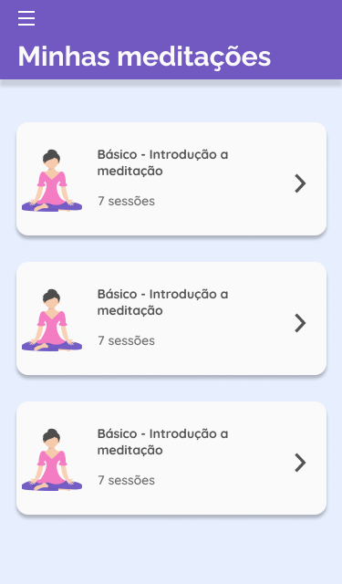
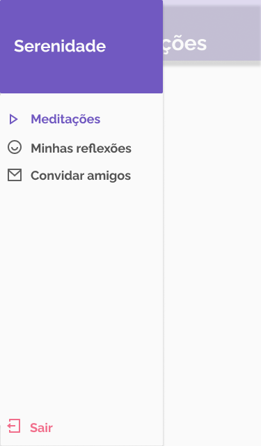

<h1 style="color: #EAAAB8">Serenidade</h1>

<h1 align="center" >
  
</h1>

<h4 align="center">☕ Code and Coffee</h4>

## 💻 Projeto

O Serenidade é um projeto que tem o objetivo de conseguir ajudar no psicológico e emocional das pessoas sem a finalidade de acumulação de capital para ajudar em vários tipos de situações.
## 🔖 Layout

Você pode baixar o layout do projeto no formato `.sketch` através [desse link](https://www.figma.com/file/YHMM04WUmNh2uk9VK96PQX/Serenidade-UI?node-id=0%3A1).

Para abrir o arquivo no formato `.sketch` em qualquer sistema operacional utilize a ferramenta [Zeplin](https://zeplin.io) ou acesse o [Figma](https://www.figma.com/).

Acessse o [Design System Manager](https://www.figma.com/file/T5cICUSrCaZpGrORbW8wC5/DSM-Serenidade?node-id=0%3A1) para ver nosso DSM.

## 🔖 Telas

<p align="center">
    
    
    
    
    
    
    
    
    
</p>

## ⚛ Rodar a aplicação
### Windows
Usando o chocolatey, baixando [Chocolatey](https://chocolatey.org/courses/installation/installing).

Depois disso abra o Windows Terminal ou PowerShell em modo administrador e execute ```choco install nodejs```.

Quando terminar de instalar o NodeJS, instale o Yarn com o comando ```choco install yarn```.
### MacOS
Usando o brew que já vem instalado por padrão no macOS.

Depois disso abra o terminal do macOS e execute ```brew install node```.

Quando terminar de instalar o NodeJS, instale o Yarn com o comando ```brew install yarn```.
## ⚛ Backend
Abra o terminal de sua preferência e acesse a pasta **backend** do projeto pelo terminal, ```cd backend```.

Logo após execute o comando ```yarn``` para instalar as dependências necessárias do projeto.

Ao terminar de instalar as dependências execute o comando ```yarn dev:server``` para iniciar o servidor em ambiente de desenvolvimento.
## ⚛ Mobile
Abra o terminal de sua preferência e acesse a pasta **mobile** do projeto pelo terminal, ```cd mobile```.

Logo após execute o comando ```yarn``` para instalar as dependências necessárias do projeto.

Ao terminar de instalar as dependências execute o comando ```yarn android``` para instalar o aplicativo em um dispositivo android. Se preferir instalar em um dispositivo iOS, execute ```yarn ios```.
## 🤔 Como contribuir

- Faça um fork desse repositório;
- Cria uma branch com a sua feature: `git checkout -b minha-feature`;
- Faça commit das suas alterações: `git commit -m 'feat: Minha nova feature'`;
- Faça push para a sua branch: `git push origin minha-feature`.

Depois que o merge da sua pull request for feito, você pode deletar a sua branch.

---

<h5 align="center" style="color:#EAAAB8">Desenvolvido com ♥ by Serenidade</h5>